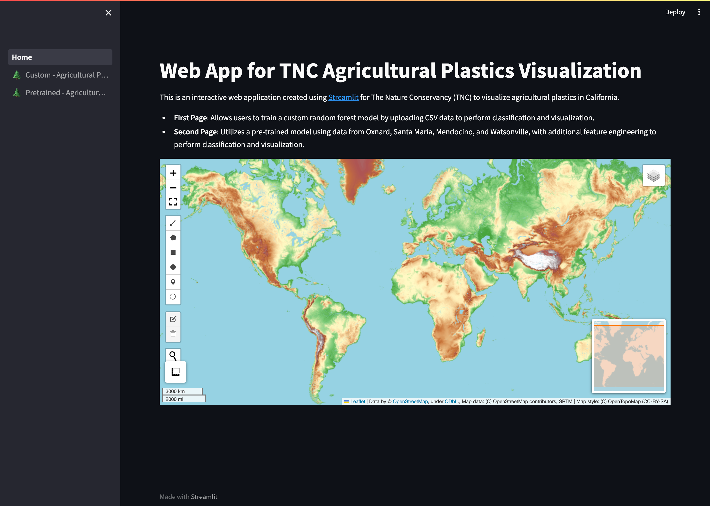
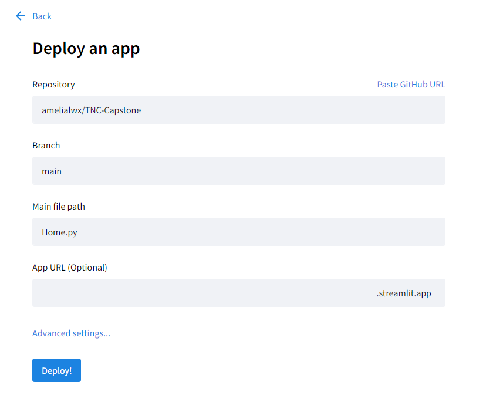
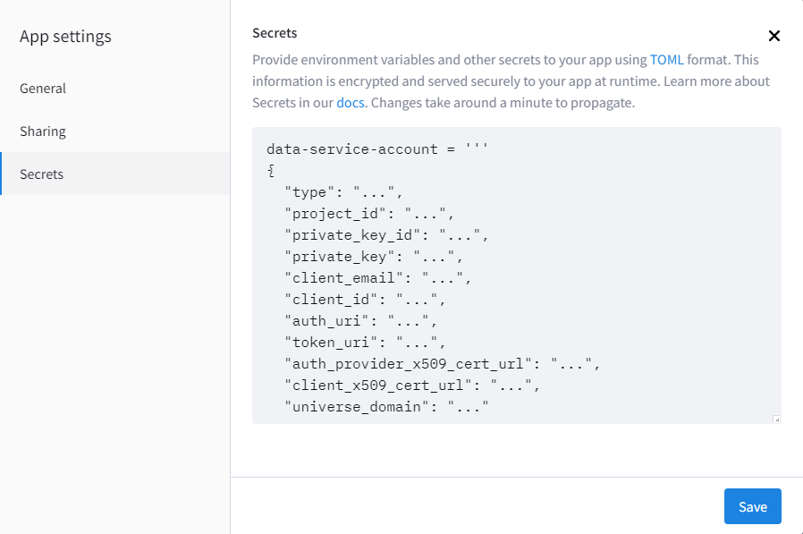
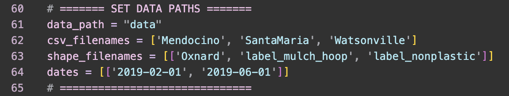

# TNC Agricultural Plastics Mapping: Capstone

## Project Team

**The Nature Conservancy**

**Partners**: Darcy Bradley, Kirk R. Klausmeyer

**Mentors**: Chase Van Amburg, Usha Bhalla

**Members**: Amelia Li, Rebecca Qiu, April Chang, Peter Wu, Evan Arnold

## Description

This is the Agricultural Plastics Mapping Capstone project for The Nature Conservancy (TNC). 

## Project Deliverables

1. [Code](https://github.com/amelialwx/TNC-Capstone/blob/main/deliverables/Capstone_Notebook.ipynb)
2. [Poster](https://github.com/amelialwx/TNC-Capstone/blob/main/deliverables/Capstone_Poster.pdf)
3. [Paper](https://github.com/amelialwx/TNC-Capstone/blob/main/deliverables/Capstone_Paper.pdf)
4. [Web App](https://tnc-web-app.streamlit.app/)

## Project Organization

    .
    ├── Home.py
    ├── LICENSE
    ├── README.md
    ├── app
    │   └── fnc.py
    ├── assets
    │   ├── deploy.png
    │   ├── home.png
    │   ├── page1_demo.gif
    │   ├── page2_demo.gif
    │   ├── page2_paths.png
    │   ├── secrets_local.png
    │   └── secrets_streamlit.png
    ├── data
    │   ├── Mendocino.csv
    │   ├── Oxnard.cpg
    │   ├── Oxnard.dbf
    │   ├── Oxnard.fix
    │   ├── Oxnard.prj
    │   ├── Oxnard.shp
    │   ├── Oxnard.shx
    │   ├── SantaMaria.csv
    │   ├── Watsonville.csv
    │   ├── label_mulch_hoop.cpg
    │   ├── label_mulch_hoop.dbf
    │   ├── label_mulch_hoop.fix
    │   ├── label_mulch_hoop.prj
    │   ├── label_mulch_hoop.shp
    │   ├── label_mulch_hoop.shx
    │   ├── label_nonplastic.cpg
    │   ├── label_nonplastic.dbf
    │   ├── label_nonplastic.fix
    │   ├── label_nonplastic.prj
    │   ├── label_nonplastic.shp
    │   └── label_nonplastic.shx
    ├── deliverables
    │   ├── Capstone_Notebook.ipynb
    │   ├── Capstone_Paper.pdf
    │   └── Capstone_Poster.pdf
    ├── pages
    │   ├── 🌲 Custom - Agricultural Plastics Classification.py
    │   └── 🌲 Pretrained - Agricultural Plastics Classification.py
    ├── requirements.txt
    └── startup.sh

## Web Application

The TNC web visualization application, built using [Streamlit](https://streamlit.io/), aims to visualize and classify agricultural plastics, providing insightful data to drive environmental conservation efforts.

This app consists of two main pages, each offering unique functionalities:
1. **First page (🌲 Custom - Agricultural Plastics Classification)**: Allows for the user to train a custom model by uploading CSv data to perform classification and visualization.
2. **Second page (🌲 Pretrained - Agricultural Plastics Classification)**: Utilizes a pre-trained model using data from Oxnard, Santa Maria, Mendocino, and Watsonville with additional feature engineering to perform classification and visualization.

## Local Installation and Setup

**Prerequisites**
```
python --version
```
If you have python 3.12 or above, the app might not work. You can download Python 3.11.6 [here](https://www.python.org/downloads/release/python-3116/).

**Installation Steps**
1. Clone the repository: 
```
git clone https://github.com/amelialwx/TNC-Capstone.git
```
2. Navigate to the project directory:
```
cd TNC-Capstone
```
3. Install dependencies
```
pip install -r requirements.txt
```
4. Registering for a Google Earth Engine account
- Head to [Google Earth Engine](https://code.earthengine.google.com/)
- Sign in with your Google account
- Register a new project or use an existing cloud project
- Head to [GCP Console](https://console.cloud.google.com/home/dashboard) and make sure that you are within the cloud project you just created
- Search for "Google Earth Engine API" from the top search box and enable it
- Search for "Service Accounts" from the top search box OR go to: "IAM & Admins" > "Service Accounts" and create a new service account called "data-service-account"
- For "Grant this service account access to project", select "Earth Engine Resource Admin"
- Click done. This will create a service account
- Click on the "..." under the "Actions" column and select "Manage keys"
- Click on "ADD KEY" > "Create new key" with "Key type" as JSON
- Navigate to `~/.streamlit/secrets.toml` for macOS/Linux or `%userprofile%/.streamlit/secrets.toml`
- Paste the content of the downloaded JSON file into `secrets.toml` within the `data-service-account` variable
- `service_account` should be the same as `client_email`
```
data-service-account = '''
{
  "type": "...",
  "project_id": "...",
  "private_key_id": "...",
  "private_key": "...",
  "client_email": "...",
  "client_id": "...",
  "auth_uri": "...",
  "token_uri": "...",
  "auth_provider_x509_cert_url": "...",
  "client_x509_cert_url": "...",
  "universe_domain": "..."
}
'''
service_account = "..."
```

**Running the app**

1. Start the server:
```
sh startup.sh
```
2. The app should now be running in your browser.


**Deployment**

1. Create a streamlit account [here](https://share.streamlit.io/)
2. Follow these [instructions](https://docs.streamlit.io/streamlit-community-cloud/deploy-your-app)
3. Your app is now deployed

4. Under the settings of the app, paste the content of `secrets.toml` into Streamlit secrets

5. Reboot the app to integrate the new Streamlit secrets

## Usage

**Page 1 (🌲 Custom - Agricultural Plastics Classification)**

Features:
- Allows for single/multiple CSV file uploads to train a custom random forest model
- Select a California county to classify on
- Change the number of trees to use for the random forest model
- Select a target date range for classification
- Visualization with slider for side-by-side comparison of two layers
- Customize left and right layer
- Display the uploaded CSV files as dataframes


**Page 2 (🌲 Pretrained - Agricultural Plastics Classification)**

Features:
- Utilizes a pretrained model with additional feature engineering on pre-existing data
- Select a Californa county to classify on
- Select a target date range for classification
- Visualization with slider for side-by-side comparison of two layers
- Customize left and right layer
- Display the CSV data as dataframes


Any new data for this page must be placed in the data folder and specified under data paths at line 60.


## Acknowledgements

Special thanks to Darcy and Kirk for their expert guidance as project partners, and to our mentors, Chase and Usha, for their invaluable support. Our appreciation also goes to Yuanyuan for her advisory role and to TNC volunteer Brandee, whose data contribution was essential to our project's success.
